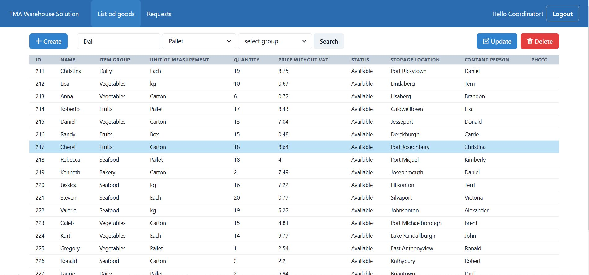
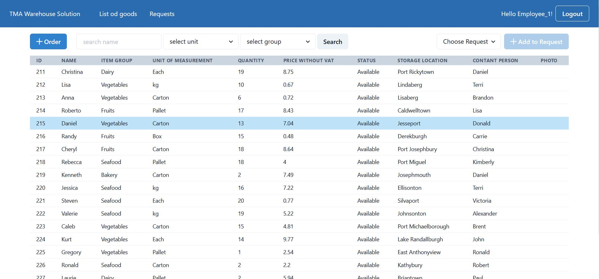

# Warehouse Solution

## Table of Contents
* [General Info](#general-information)
* [Technologies Used](#technologies-used)
* [Features](#features)
* [Setup](#setup)
* [Database Structure](#database-structure)
* [Application View](#application-view)
* [Project Status](#project-status)
* [Future Plans](#future-plans)


## General Information
This application is a simplified realization of the simplified warehouse management 
system (ERP like functionality). There exist two distinct roles in the 
system, employee and coordinator, each having the distinct permissions and 
functionalities. The whole application was written in the span of 5 days as an 
assignment, but I was quite curious if I would be able to write something like this 
in the limited amount of time as well.

## Technologies Used
<ul>
<li>Django</li>
<li>DRF</li>
<li>JavaScript</li>
<li>HTML5 & CSS3</li>
<li>ChakraUI</li>
<li>React Router</li>
</ul>

## Features

* Two roles in the system: coordinator and employee
* Employee can order items by creating requests that can be further approved or 
  rejected by coordinator.
* Coordinator can accept or reject the request as well as update the warehouse state 
  (add, remove items or update quantities)
* All data is presented in the tables with custom sorting, filtering and searching 
  functionality that allows quickly locate the interesting item

## Setup
Make sure you have Node installed on your machine.

```bash
# Clone this repository
$ git clone https://github.com/MarcinRubin/Bridge_Deals_Library


# Initialize the backend
# From the main directory
$ cd warehouse_solution_backend
$ pip install -r requirements.txt
$ python manage.py makemigrations
$ python manage.py migrate
$ python manage.py createsuperuser
# Optional step that creates the sample database
$ python manage.py create_test_db
$ python manage.py runserver

#Initialize the frontend
# From the main directory
$ cd warehouse_solution_frontend
$ npm install
$ npm run dev
```

## Database Structure


## Application View
<h3>Coordinator view</h3>




<h3>Employee wiew</h3>




<h3>Login page</h3>


## Project Status
Project is: _in progress_


## Future Plans

- Dockerize application
- Change the database used to postgres or sql server
- Overall code refactoring

